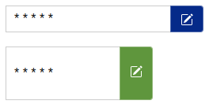
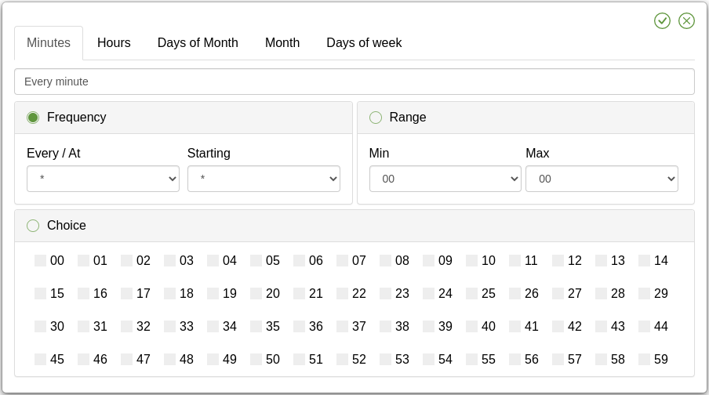
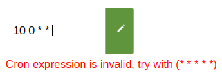

<h1 align="center" style="font-size: 50px;">Welcome to Cron Input UI library 👋</h1>

## ✨ Description

**Cron Input UI**: Input component to generate cron expressions easily and intuitively, as in [crontab.guru](https://crontab.guru/).


### 📸 Previews

Input look (customizable, multiple)



Modal look



Synced expression with the input & real time human text


Warning messages




Locales support (see [Languages available](#languages))

## 📥 Installation

Cron Expression Input is exported as an [UMD](https://github.com/umdjs/umd) module so it will work in an [AMD](https://github.com/amdjs/amdjs-api/wiki/AMD), [CommonJS](https://wiki.commonjs.org/wiki/CommonJS) or browser global context.

First, install the module:

```
npm install cron-input-ui
```

Then, depending upon your usage context, add a reference to it:

### ESM / Webpack / TypeScript

```js
import 'cron-input-ui';
import 'cron-input-ui/dist/locales/en.js';
import 'cron-input-ui/dist/cron-input-ui.min.css';
```

### Browser
The `cron-input-ui.min.js` file from the `/dist` folder in the npm package should be served to the browser.  There are no dependencies so you can simply include the library in a `<script>` tag.

```html
<link rel="stylesheet" href="cron-input-ui.min.css" />

<form>
    <cron-input-ui height="34px" width="250px" color="d58512" required hotValidate value="* * * * *">
    </cron-input-ui>
    <input type="submit" value="Send form" style="margin-top: 20px;" />
</form>

<script src="cron-input-ui.min.js" type="text/javascript"></script>
<script src="locales/en.js" type="text/javascript"></script>
```

### CDN

A simple way to load the library in a browser is by using the [unpkg](https://unpkg.com/) CDN, which is a
"fast, global content delivery network for everything on npm". To use it, include a script tag like this in your file:

```html
<script src="https://unpkg.com/cron-input-ui@2.0.0/dist/cron-input-ui.min.js" async></script>
<!-- Language (Optional) -->
<script src="https://unpkg.com/cron-input-ui@2.0.0/dist/locales/en.js" async></script>
```

Using the "latest" tag will result in a 302 redirect to the latest version tag so it is recommended to use a specific version tag such as https://unpkg.com/cron-input-ui@2.0.0/dist/cron-input-ui.min.js to avoid this redirect.

### React

```javascript
import 'cron-input-ui/dist/cron-input-ui.min.css';
/* Language (Optional) */
import 'cron-input-ui/dist/locales/en.js';
require('cron-input-ui');

class App extends React.Component {
    constructor(props) {
        super(props);
        this.state = { cron: '* * * * *' };
    }

    render() {
        return (
            <div>
                <cron-input-ui
                  value={this.state.cron}
                  onInput={(e) => this.setState({ cron: e.nativeEvent.detail.value })}
                  color='d58512'
                  value={this.state.cron}
                  required
                  hotValidate />
            </div>
        );
    }
}

export default App;
```

### Vue

```javascript
<template>
  <div id="app">
    <cron-input-ui
      :value="cron"
      v-on:input="cron = $event.detail.value"
      color="d58512"
      :required="true"
      :hotValidate="true"
     />
  </div>
</template>

<script>
import 'cron-input-ui/dist/cron-input-ui.min.css';
import 'cron-input-ui/dist/locales/en.js'; /* Language (Optional) */
require('cron-input-ui'); /* JAVASCRIPT */

export default {
  name: 'App',
  data() {
    return {
      cron: '* * * * *'
    }
  }
}
</script>
```

## Component Attributes

You can pass various attributes to the component to modify its behavior, Example with color attribute: <cron-input-ui color="#d58512"></cron-input-ui>

|Name|Type|Default Value|Description|
|:--:|:--:|:-----------:|:----------|
|**`name`**|`{String}`|`cron`|The name that the form variable|
|**`width`**|`{String}`|`234px`|The width of the component input|
|**`height`**|`{String}`|`34px`|The height of the component input|
|**`value`**|`{String}`|`* * * * *`|Allow to set a default value on the component|
|**`color`**|`{String}`|`#d58512`|The main color that the component elements will take, (hexadecimal recommended)|
|**`required`**|`{Boolean}`|`false`|Allow component to be empty, if set, the form will not validate when empty|
|**`hotValidate`**|`{Boolean}`|`false`|Enable cron validation while editing it, if not set, it will only be validated when the submit event is performed within a form or by clicking on the save button|

## Languages

```
import 'cron-input-ui/dist/locales/es.js';
OR
<script src="https://unpkg.com/cron-input-ui@2.0.0/dist/locales/es.js"></script>
```

* en (English)
* fr (French - Français)
* es (Spanish - Español)
* zh_CN (中文 - Chinese)

## Integration

Choosing a lang, from the CDN or via custom import will try to implement cRonstrue language corresponding if it exists.

This was not tested for any personal language but it should work if the lang code is the same (POSIX format).

### Thanks

-   [@JossyDevers](https://github.com/JossyDevers), The original author of this library that made this great project.
-   [@TheCloudConnectors](https://github.com/TheCloudConnectors), For your npm package to validate the structure of a cron expression [cron-validator](https://github.com/TheCloudConnectors/cron-validator).
-   [@bamotav](https://github.com/bamotav), For the idea of ​​creating this web component.
